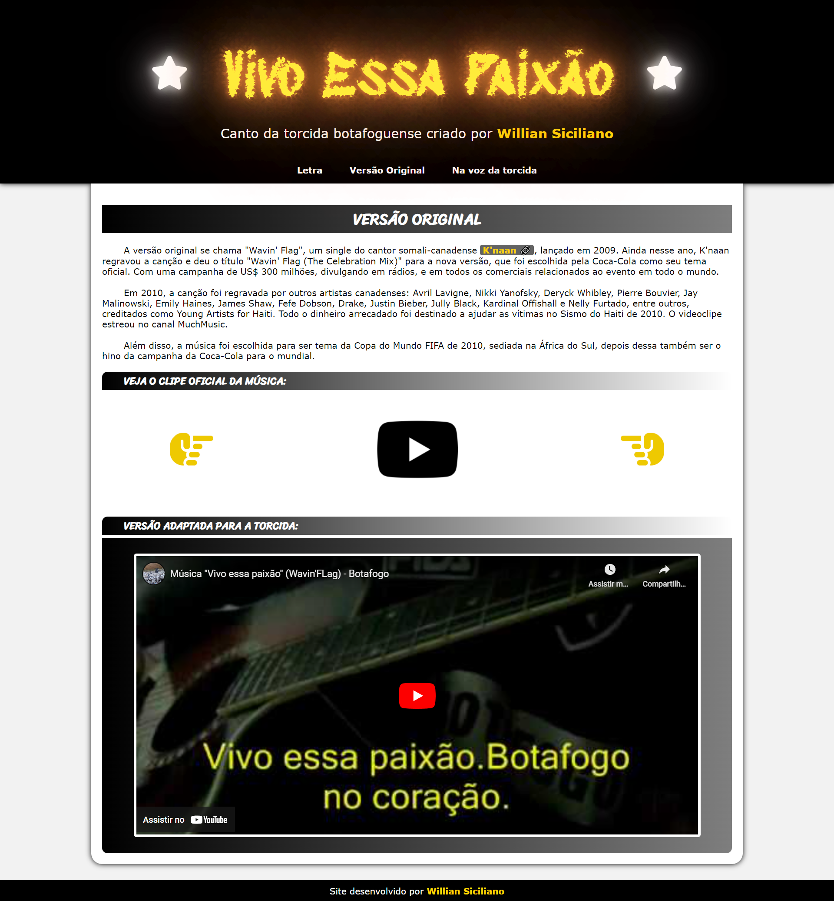

<h1 align="center"> Projeto "Vivo Essa Paixão"</h1>

Sobre a música "Vivo Essa Paixão", criada por mim para a torcida do Botafogo em 2010 e cantada até hoje nos estádios.

  <a href="#-tecnologias">Tecnologias</a>&nbsp;&nbsp;&nbsp;|&nbsp;&nbsp;&nbsp;
  <a href="#-projeto">Projeto</a>&nbsp;&nbsp;&nbsp;|&nbsp;&nbsp;&nbsp;
  <a href="#memo-licença">Licença</a>

ACESSE O SITE <a href="https://williansiciliano.github.io/projeto-vivo_essa_paixao/" target=_blank>CLICANDO AQUI</a>!

  

 

  

  

  

## ⚙️ Tecnologias

Este projeto foi desenvolvido utilizando as seguintes tecnologias:

- HTML e CSS
- JavaScript
- Git e Github

## 💻 Projeto

Projeto desenvolvido para treinar técnicas como: 'Fire Effects', 'Background Slider', 'Glow Effects' e Animações em geral com CSS.

## 📝 Licença

Esse projeto está sob a licença MIT.